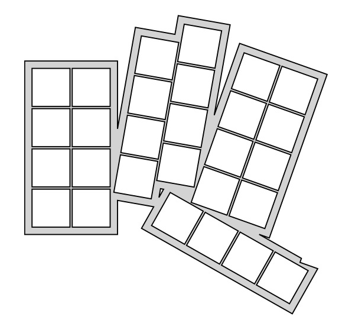
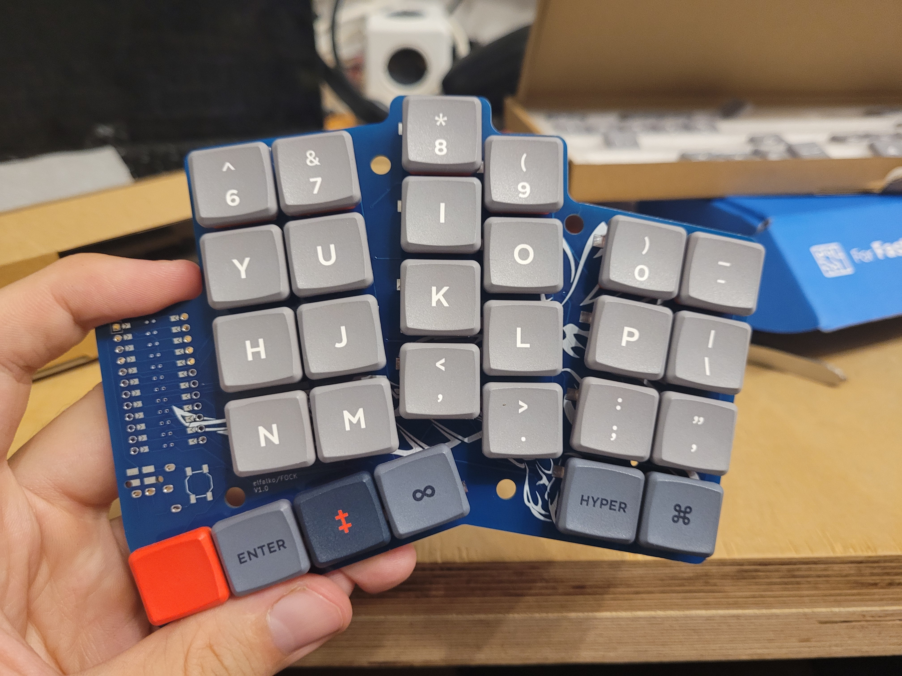

# FOCK - Falk's Overstaggered Corne Keyboard

## Status

V2 is ready for production
V1 failed due to layout "improvements" with traces on the wrong PCB side

## Why

[CRKBD](https://github.com/foostan/crkbd) is nice, but could use more stagger, a num row and USB-C

## Features

So far planned are:

* ZMK support
* 56 keys
* puchi-c driven, pro-micro compatible
* usb c cable for connection between halves
* battery support for future bluetooth action

## Repo overview

* Readme - this readme
* fock.yaml - generator file for [ergogen](https://github.com/ergogen/ergogen) (requires my fork though)
* img/ - images for documentation

## TODO

* [ ] optional num row
* [ ] mouse bites to break off excessive parts
* [ ] good case
* [ ] ZMK config
