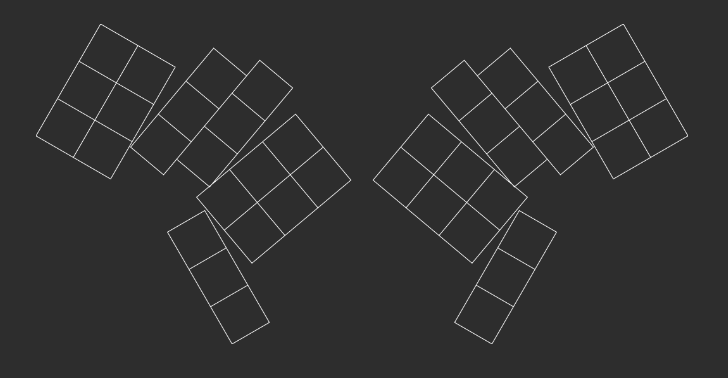

# FOCK - Falk's Overstaggered Corne Keyboard

## Status

rough layout done

## Why

[CRKBD](https://github.com/foostan/crkbd) is nice, but could use more stagger.

## Features

So far planned are:

* ZMK support
* 42 keys
* promicro driven
* usb c cable for connection between halves
* future battery support for bluetooth action

## Repo overview

* Readme - this readme
* fock.txt - generator file for [ergogen](https://github.com/ergogen/ergogen) (for direct use try [this](https://ergogen.cache.works/) and copy in the contents
* img/ - images for documentation

## TODO

* [ ] verify key sizes
* [ ] route kicad
  * [ ] promicro or similar controller
  * [ ] optional num row
  * [ ] mouse bites to break off excessive parts
  * [ ] battery
  * [ ] usb c connectors
* [ ] good case
* [ ] ZMK config
