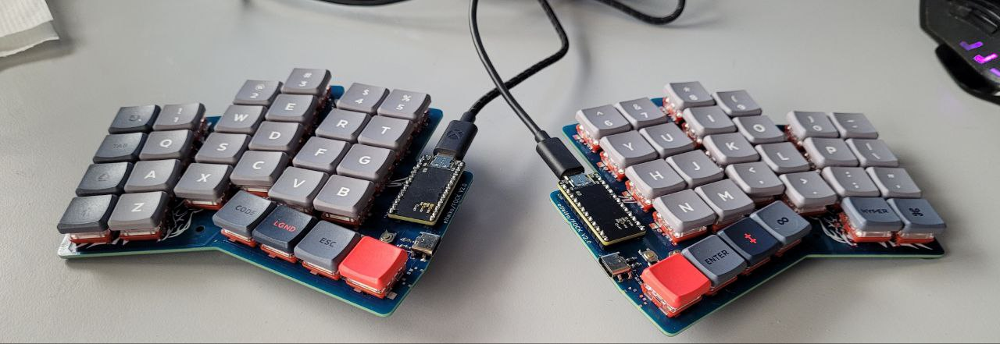

# FOCK - Falk's Overstaggered Corne Keyboard

FOCK at work, still waiting for batteries

## Status

V2 is my daily driver running on ZMK since 09/22
There is no firmware supporting the USB-C connection between halves yet, but electronically the connections should be sound.

## Why

[CRKBD](https://github.com/foostan/crkbd) is nice, but could use more stagger, a num row and USB-C

## Features

* fully reversible PCB
* 54 keys (6x4 + 4 thumb keys per side)
* nice!nanoV2 driven, pro-micro compatible
* usb c cable for connection between halves
* battery support
* [ZMK support](https://github.com/elfalko/fock-zmk)

Explicitly not planned:

* LEDs (over/under/any glow)
* return to TRRS
* Rotary encoders

## Repo overview

* Readme - this readme
* fock.yaml - generator file for [ergogen](https://github.com/ergogen/ergogen) (requires [the master branch from my fork](https://github.com/elfalko/ergogen/tree/master) though, since several footprints have been heavily updated)
* img/ - images for documentation
* [Assembly manual](./assembly.md)

## TODO or future plans

* [ ] QMK support
* [ ] optional num row w mouse bites
* [ ] good case
* [ ] trackball/trackpad support

## License and usage

Feel free to use anything in this repo for inspiration and for any projects.
If you do, please send me a message, I will be stoked to hear about it.

Officially, this is under LGPLv2.1 license.

Please be aware that this is a personal project and not subject to any kind of safety testing other than me using it daily and not having electrified myself doing so (yet).
All risks using this are your own.

